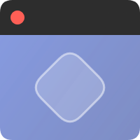

#  Top Panel Logo

Top Panel Logo is a **lightweight GNOME Shell extension** that **adds a customizable icon to the top panel**.

Both left‑click and right‑click actions are configurable, allowing for powerful shortcuts without cluttering your workflow.

## ✨ What it does

It lets you personalize your GNOME desktop with the icon of your choice. You can easily pick the icon, adjust its size and position, and customize what happens when you click on it!

Designed to be lightweight and efficient: no background polling, no unnecessary signals, no bells and whistles.

## 🛠 Available Actions

For either Left Click or Right Click (independently), choose from:

- 'Show Overview' – Opens/closes GNOME Activities Overview.

- 'Show Apps Grid' – Opens/closes GNOME Applications Grid view.

- 'Hide Visible Windows' – Matches GNOME's “Hide all normal windows” behavior.

- 'Open System Monitor' – Launches gnome-system-monitor if installed.

- 'Launch App' – Launch a user‑chosen application (with Flatpak, AppImage and .desktop support).

- 'Custom Command' – Run any shell command you define.

- 'Do Nothing' - Does nothing.

## 🎨 Icon Customization

- 'Path' – Point to any image or icon MIME file type (.ico, .png, .svg, .jpeg, .webp, etc).

- 'Position' – Select between left, center and right.

- 'Order' – Define the order within the panel.

- 'Size' – Set the pixel size of your panel icon.

- 'Padding' – Adjust space on either side of the icon.

## 🚀 Usage Examples

Left click: Show Overview, Right click: Hide All Windows.

Left click: Launch Terminal, Right click: Open System Monitor.

Left click: Custom Command, Right click: Show Apps Menu.

## 📦 Installation

There are several ways of installation:

- From [GNOME Extensions website](https://extensions.gnome.org/extension/8559/top-panel-logo/):

- From [GitHub](https://github.com/jmpegi/top-panel-logo):
  1. Clone this repo to `~/.local/share/gnome-shell/extensions/top-panel-logo@jmpegi.github.com`.
  2. Restart GNOME Shell (logout or reboot).
  3. Enable the extension.

     NOTE: You can also install the extension system-wide by placing it in `/usr/share/gnome-shell/extensions/top-panel-logo@jmpegi.github.com` instead. This is not recommended.

## 📋 Notes

- GNOME Shell 45+ is required.

- 'Launch App' and 'Custom Command' use GLib.spawn_command_line_async(). Keep in mind that:
  - It spawns a background child process started by GNOME Shell, and as such, it inherits GNOME Shell's environment (which usually comes from ~/.profile, systemd‑user, etc.). This child proccess does NOT use your system's shell environment (from ~/.bashrc or ~/.zshrc).
  - To use your personalized bash environment (including aliases and custom $PATH), wrap commands with 'bash -ic'. For example:  
  `bash -ic 'yourcommand'`
  - Apps usually open their own window, but command-line tools and scripts do not. To run them inside a terminal and keep the window open, you can use:  
  `gnome-terminal -- bash -c 'yourcommand; wait'` or  
  `gnome-terminal -- bash -c 'yourcommand; exec bash'` or  
  `gnome-terminal -- bash -c 'yourcommand; read -p "Press ENTER to close..."'`
  - For maximum reliability, use full paths to scripts and binaries (e.g., /home/user/bin/yourscript.sh).
  - Only use valid executable commands that you fully trust.

## 💡 Tips

- Most GNU/Linux distributions store their logo somewhere inside `/usr/share/pixmaps/` or `/usr/share/icons/`

- For ease of use, disable 'Hot Corner' under 'GNOME Settings/Multitasking'.

## 📝 License

Copyright (C) 2025-2026 jmpegi <jmpegi@protonmail.com>.  
Released under GPL‑3.0 — feel free to modify or contribute.

Any feedback, ideas and bug reports are welcome!
